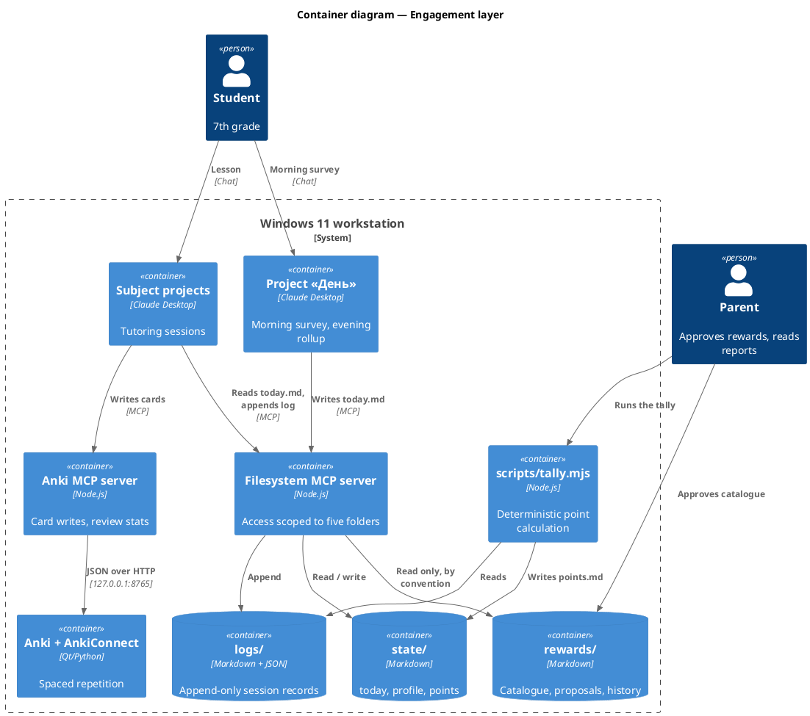

# Engagement System — Design and Operation

The tutoring stack teaches; this layer makes a 12-year-old want to show up for
it. It adds a daily theme chosen by the student, a tone he picks, points that
are computed rather than negotiated, a reward catalogue his parent approves,
and an integrity model that does not rely on catching him.

| Part | Mechanism | Where it lives |
|---|---|---|
| Daily personalization | 4-question morning survey | `prompts/day-start.md` → `state/today.md` |
| Themed delivery | Decoration rules applied to examples and problems | `prompts/subject-tutor.md` |
| Points | Deterministic formula over session logs | `scripts/tally.mjs` → `state/points.md` |
| Rewards | Parent-approved catalogue with tiers | `rewards/catalogue.md` |
| Engagement data | Per-session structured record | `logs/<date>-<subject>.md` |
| Integrity | Defense questions plus Anki as the real check | `prompts/subject-tutor.md` |
| Purpose | Honest per-topic answers to «навіщо це вчити» | `curriculum/why/` |
| Direction | Monthly aspiration check-in, feeding the emphasis plan | `state/aspirations.md` |

The layer is additive. Every part can be switched off in the project
instructions without touching Kolibri, Anki or the MCP bridge.

---

## 0. Architecture



The load-bearing decision is the split between the two writers. **The model
records observations; the script computes points.** A model that awards its own
points will be talked into awarding more of them — negotiation is the one
thing a 12-year-old will reliably out-practise everyone at. `scripts/tally.mjs`
reads append-only logs and applies a fixed formula, so the number is not a
matter of opinion.

---

## 1. Design rules

These constrain everything below. Each exists because of an obvious failure
mode the system would otherwise walk straight into.

| Rule | Failure it prevents |
|---|---|
| The theme changes decoration, never the learning goal | Star Wars algebra where the algebra quietly disappears |
| A theme must not add steps to a problem | A story so elaborate that unwrapping it is harder than the maths |
| Points reward process, not correctness | Avoiding hard topics, hiding gaps, refusing hints |
| Points are computed by script, not by the tutor | Point inflation through negotiation |
| The tutor never names a reward outside `rewards/catalogue.md` | A hallucinated promise the parent has to break |
| The tutor never accuses, it asks | One false accusation ends trust in the whole system |
| The survey stays under a minute | An engagement ritual that itself becomes a chore |

---

## 2. Morning survey

Run once a day in the `День` project, before the first lesson. Four questions,
target 40 seconds. The answers are written to `state/today.md`, which every
subject session reads.

| Question (Ukrainian) | Options | Effect |
|---|---|---|
| Яка сьогодні погода? | ☀️ ⛅ 🌧 ⛈ | Lesson length and difficulty ramp. Never content |
| Всесвіт дня | From `prompts/themes/`, or `своє` | Decoration of examples and problems |
| Подача | нейтрально / по-пацанськи / тренер / челендж | Tone profile |
| Рівень | 7 з 10 / 9 з 10 | Difficulty and the point multiplier |

The weather question is a mood check that does not sound like one. Children
answer a metaphor more honestly than a scale. A `⛈` answer does not cancel the
lesson: it shortens it and replaces new material with consolidation of old.

The difficulty question is the most valuable of the four. A student who chose
`9 з 10` himself behaves differently from one handed the same problems, and
over a month the pattern of what he picks reads his confidence better than any
self-report would.

---

## 3. What the theme may touch

| Layer | Themed? |
|---|---|
| Definitions, formulas, rules, proofs | **Never.** Verbatim from the textbook |
| Difficulty | **Never.** Set by the curriculum and the morning choice |
| Names, objects and setting in problem statements | Yes |
| Examples used in explanation | Yes |
| Register of speech | Yes |
| Between-block facts | Yes |

The second rule of §1 is the one violated in practice. A problem about
hyperdrive fuel ratios must not require any knowledge of hyperdrives to reach
the ratio. If parsing the story is harder than the mathematics, the theme has
worked against the lesson, and the tutor is instructed to strip it.

A stronger format than decoration alone is **«Міф чи фізика?»** — take a scene
from the chosen universe and check it against the textbook:

```text
Сцена: винищувач різко гальмує в космосі й зупиняється на місці.
Що не так? Що станеться насправді?
```

It is thematic, genuinely interesting, rehearses the actual law, and it cannot
produce invented trivia — the thing being checked is the fiction, and the thing
checking it is the textbook.

---

## 4. Tone profiles

Fixed profiles, not improvised each session. All output is Ukrainian.

| Profile | Register | Sample opening |
|---|---|---|
| `нейтральний` | Plain, warm, no slang | «Сьогодні розкладання на множники. Почнемо з одного питання.» |
| `по-пацанськи` | Peer slang, short sentences | «Йо. Рівень 7 з 10, тема — розкладання на множники. Слабо без жодної помилки?» |
| `тренер` | Sports coach, effort-focused | «Розминка — одне питання. Потім три підходи, вага зростає.» |
| `челендж` | Framed as a run with a score | «Три задачі, кожна складніша. Скільки візьмеш без підказки?» |

The slang profile carries a specific risk: a model performing teenage register
lands as an adult trying very hard to sound young, which a 12-year-old detects
instantly and resents. The mitigation is measurement rather than care — the
end-of-lesson question `тон норм чи кринж?` is asked every time, and two
`кринж` answers in a row disable the profile automatically.

---

## 5. Inside the lesson

The tutoring protocol from `learning-stack-windows11-install.md` §5 still runs.
This layer adds four things to it.

| Addition | What it is |
|---|---|
| Defense question | After every solved problem: «а чому саме так?». One sentence back is enough |
| Boss level | One optional harder problem, framed as a boss fight. Skippable with no penalty, worth extra points |
| Fact break | One «Міф чи фізика?» or theme fact after a correct answer, at most twice a session |
| Streak | Consecutive days with a completed lesson, with one free freeze per week |

The freeze matters more than it looks. An unbreakable streak that dies to a
fever turns a motivator into a reason to quit, and it costs nothing to build.

---

## 6. Points

Awarded by `scripts/tally.mjs` from the JSON block in each session log.

| Event | Points |
|---|---|
| Lesson completed | 10 |
| Morning Anki cards cleared | 5 |
| Genuine attempt on a problem, even wrong | 3 |
| Problem solved unaided | 5 |
| Problem solved after a hint | **5** |
| Defense question answered | 2 |
| Boss level attempted | 5, and 5 more if solved |
| A topic stopped failing in Anki | 10 |
| End-of-lesson feedback given | 2 |
| Difficulty multiplier on the session total | ×1.0 at `7 з 10`, ×1.3 at `9 з 10` |

Solving unaided and solving after a hint pay **the same**. Paying more for
unaided answers teaches exactly the wrong lesson: pick easy topics, hide
confusion, never ask. What the system is trying to grow is willingness to
engage with difficulty, not a display of what was already known.

Two separate numbers come out of the tally, and confusing them breaks the
reward rules:

| Number | Meaning |
|---|---|
| **Earned** | Total accumulated in a period. Determines reward tiers |
| **Balance** | Earned minus spent. Determines what can be claimed now |

Monthly and quarterly rewards are keyed to *earned*, so spending points on a
Friday never costs the guaranteed monthly reward.

---

## 7. Rewards

| Period | Rule |
|---|---|
| Day | Threshold met → claim something small, or bank it. Banking adds **+10%** to that day when the week closes |
| Week | Bronze / silver / gold tiers by earned points |
| Month | Always something. Tier by earned points |
| Quarter | Always something, larger. Tier by earned points |

The banking bonus is the smallest mechanism here and probably the most
valuable: it pays for choosing to wait, which is a better habit than anything
in the catalogue.

The catalogue lives in `rewards/catalogue.md`, parent-approved, each item
priced in points and tagged with a budget band. The student proposes additions
in `rewards/proposed.md`; the parent moves approved ones into the catalogue
with a price. The tutor may read the catalogue to motivate — «до срібла 40
балів» — and may never invent an item that is not in it.

**Every threshold in this document is a placeholder.** Nobody knows this
student's baseline output yet. Run two weeks with points recorded and no
thresholds applied, then set the tiers from real numbers — that is
`tasks/16-calibration-window.md`.

One factor worth holding in mind for the end of term: paying for something a
person would do anyway tends, over time, to replace their own reason for doing
it. Three choices here soften that — payment is for process rather than
results, large rewards are periodic and predictable rather than escalating, and
the system is built to be wound down once the habit stands. That is not an
argument against building it; it is the thing to watch for around December.

---

## 8. Engagement data

Each session appends one log file holding a JSON block (schema in
`logs/README.md`) and free-text notes. The end-of-lesson survey is three
questions, ten seconds:

```text
Зрозуміло? Цікаво? Тон норм чи кринж?
```

**Timing cannot be measured properly, and the design does not pretend
otherwise.** Claude Desktop does not expose per-message timestamps to the
model, and there is no maintained npm MCP time server to add one. The "stuck on
a question" signal is therefore captured behaviourally instead:

| Signal | Recorded as |
|---|---|
| Four or more turns on one problem without progress | `stalled: true` on that task |
| Answers collapsing to one word or «не знаю» | `disengaged: true` on the session |
| Session abandoned before the cards were written | `completed: false` |

These catch what a stopwatch was meant to catch, and they do not confuse "sat
thinking hard for six minutes" with "went to get a drink".

With one student and a handful of sessions a week, no correlation in this data
is statistically real for months. The weekly report is a conversation opener —
«третій тиждень поспіль береш легкий рівень з хімії, що там?» — not an
analytics product.

---

## 9. Integrity

Detecting whether an answer came from another chatbot is **not reliably
possible**, and a false accusation costs far more than a missed cheat. The
design therefore does not attempt detection. It removes the payoff.

| Mechanism | How it works |
|---|---|
| Defense question | «А чому саме так?» after a correct answer. A pasted answer does not survive one follow-up. The most effective mechanism here, and it needs no technology |
| Process-weighted points | Copying an answer earns barely more than an honest failed attempt, so the incentive disappears |
| Anki as the real check | Cards from a faked lesson fail on review three days later. High in-lesson accuracy plus failing cards on the same topic is the signal |
| Clean-room measurement | One coach-assigned Kolibri quiz a week, taken without a chat window open |
| A stated rule | Agreed once, in writing: asking for an explanation is encouraged, submitting someone else's answer is not |

The consequence ladder, per the policy chosen for this setup:

1. The problem is re-taught, not scored as understood. No accusation is made
   and no points are removed.
2. Repeated on the same topic — it goes into the weekly report as a topic to
   revisit.
3. Beyond that it is a parent conversation, never a model one.

The tutor is explicitly instructed never to state or imply that the student
cheated. It asks the defense question and works from that answer alone.
Blocking other AI sites at the network level is possible and is not
recommended: it is an arms race against a teenager with a phone, and it
reframes school as something to outwit.

---

## 10. Purpose and direction

«Навіщо мені це вчити?» is asked in every session that matters, and the usual
answers — it develops your thinking, you will need it in life — are heard as
*I do not have a real answer*. The layer that handles this has three parts.

### Honest per-topic answers

One table per subject in `curriculum/why/`, giving the answer for each topic
in the order: what breaks without it, where it works in the thing he says he
wants to do, what it unlocks next, and — when none of those is true — the plain
truth that it is a prerequisite and that is the whole reason.

The fourth answer is the one that makes the other three work. Some school
topics have no strong direct application; dressing one up gets caught, and
afterwards every genuine answer sounds like sales talk. Writing the answers
down in advance is what keeps that rule enforceable, because a model asked
live will always produce something plausible.

### Monthly aspiration check-in

Four questions once a month, recorded verbatim in `state/aspirations.md` and
never overwritten. `curriculum/directions.md` maps each direction to what it
actually takes and what the next concrete step would be.

Two design choices worth stating:

| Choice | Reason |
|---|---|
| Ask what he **did** this month, not only what he wants | Behaviour is a better signal than aspiration, and he answers it more honestly |
| Never react to the answer, positively or negatively | Both teach him to give the expected answer next month |

A stated direction at twelve is unstable, and that is fine — it is raw material
for answering «навіщо», not a career decision. What matters is the interest
that persists while the labels change: «полетіти на Марс» in October and
«винаходити машини» in January are one interest wearing two names, and that one
is what should steer the plan.

### Floor and surplus

The emphasis question — lean into what he is good at, or keep everything level
— has two wrong answers. Specialising on a twelve-year-old's talent signal acts
on noise. Ignoring it entirely means the system is not listening.

So: **every subject keeps its floor, and only the surplus moves.** The floor is
the school programme, never reduced whatever the numbers say. The surplus —
optional sessions, deeper problems, enrichment, an extra course — follows
interest and progress. Emphasis is visible in what he does extra, never in what
he stops doing, and that is also the answer to «то хімію можна не вчити?».

The signals are already in the logs. The two that count most are the ones he
does not consciously report: which subject he opens first, and which topics he
asks «навіщо» about. The mechanics are in `curriculum/emphasis.md`.

The parent draws the conclusion from those numbers, not the model. One student
and a few sessions a week cannot support an inference about where talent lies,
and a confident-sounding recommendation built on that is worse than none.

---

## 11. Files and who owns them

| Path | Written by | Read by |
|---|---|---|
| `state/today.md` | `День` project, each morning | Every subject session |
| `state/profile.md` | Parent, weekly | Every session, for what works |
| `state/points.md` | `scripts/tally.mjs` **only** | Everyone, read-only |
| `state/aspirations.md` | The monthly check-in, append-only history | Every session, for a real «навіщо» |
| `logs/<date>-<subject>.md` | Subject session, append-only | The tally, the weekly report |
| `logs/<date>-day.md` | `День` project, each evening | The tally, for the claim decision |
| `rewards/catalogue.md` | Parent **only** | Tutor, read-only |
| `rewards/proposed.md` | Student, via any session | Parent |
| `rewards/history.md` | Parent, when a reward is claimed | The tally |
| `curriculum/why/<subject>.md` | Parent, from the textbook; tutor appends rows it had to improvise | Every session |
| `curriculum/directions.md` | Parent **only** | The monthly check-in |
| `curriculum/emphasis.md` | Parent **only**, monthly | Parent — it decides the surplus |

The student has the machine, so none of this is tamper-proof. It does not need
to be: the repository is under Git, the tally is deterministic, and an edited
log shows up in `git diff` immediately. The point of the ownership table is to
stop the *tutor* writing where it should not, which is the failure that would
actually happen by accident.

---

## 12. Troubleshooting

| Symptom | Cause | Fix |
|---|---|---|
| Tutor ignores the daily theme | `state/today.md` missing or the survey was skipped | Run the `День` project first; the tutor falls back to `нейтральний` |
| Tutor invents a reward | Catalogue not attached to the project, or the rule was dropped from the instructions | Re-attach `rewards/catalogue.md` and restore the rule from `prompts/subject-tutor.md` |
| `npm run tally` reports zero sessions | Log files missing their JSON block, or written outside `logs/` | Check the block against `logs/README.md`; the fence language must be `json` |
| Filesystem tools absent in Claude Desktop | Server not in `claude_desktop_config.json`, or the folder is not in its argument list | Add the folder explicitly — the server only exposes directories passed as arguments |
| Points look wrong to the student | The tally ran before the last session was logged | Re-run the tally; never edit `state/points.md` by hand |
| Theme makes problems confusing | Decoration is adding steps | Rule 2 of §1 — strip the story, keep the numbers |
| Slang tone falls flat | The model is performing a register it cannot hold | Two `кринж` answers disable it; switch to `тренер` |
| «Навіщо» is answered with «розвиває мислення» | The topic is missing from `curriculum/why/<subject>.md` and the fallback order was dropped | Restore the block in `prompts/subject-tutor.md`, then write the row |
| «Навіщо» becomes a way to stall the problem | The answer ran long and turned into a conversation | Three sentences, then straight back to the problem — the limit is the rule |
| The same «навіщо» answer comes back word for word | The tutor is reading the row aloud instead of rephrasing it | The row is source material, not a script |
| Monthly answers stop changing | The check-in reacted to a previous answer and he is repeating what landed well | Rule 2 of `prompts/aspirations.md` — no reaction, in either direction |
| A subject quietly drops out of the week | The surplus was moved and the floor went with it | §10 — the floor is the programme and never moves |

---

## 13. Verification status of the facts in this document

Written 2026-09-07. Design decisions are not claims and are not listed here.
Anything marked *unverified* should be checked before it is relied on.

| Claim | Status |
|---|---|
| `@modelcontextprotocol/server-filesystem` is published, current version `2026.8.31` (2026-08-31), binary `mcp-server-filesystem` | Verified — npm registry via `npm view`, 2026-09-07 |
| The filesystem server restricts access to the directories passed as arguments, and MCP Roots can replace that list | Verified — project README and MCP documentation |
| Claude Desktop reads MCP servers from `%APPDATA%\Claude\claude_desktop_config.json` | Verified — the same path the Anki MCP server already uses in the install guide |
| Anki accepts arbitrary CSS in the Styling section, shared per note type, with `.card`, `.cardN`, `.nightMode` and platform classes; background images are supported | Verified — Anki manual, card styling page |
| Per-subject visual themes therefore need one note type per subject | Verified — follows directly from styling being per note type |
| A `{{Field}}` substitution inside a template `class` attribute can drive per-note theming | **Unverified** — not tested. The note-type route is the safe one |
| No maintained npm MCP time server exists — `@modelcontextprotocol/server-time` returns 404 and `mcp-server-time` was unpublished on 2025-05-14 | Verified — npm registry, 2026-09-07 |
| Claude Desktop does not expose per-message timestamps to the model | **Unverified** — inferred from the absence of any documented mechanism. §8 is designed so that nothing depends on it |
| Extrinsic rewards can displace intrinsic motivation over time | **Unverified** — well established in the psychology literature, but no source was checked for this document |
| Every point value and threshold in §6 and §7 | **Unverified by design** — placeholders, to be replaced from two weeks of real logs |
| The topic rows in `curriculum/why/algebra.md` match the grade-7 programme | **Unverified** — written from general knowledge of the syllabus, not checked against the textbook. Task 18 closes this |
| The requirements listed in `curriculum/directions.md` reflect how those fields are actually entered | **Unverified** — written from general knowledge; the esports row in particular is a judgement, not a sourced claim |
| Stated career aspirations at this age are unstable and poorly predictive | **Unverified** — widely held and consistent with the design, but no source was checked |
