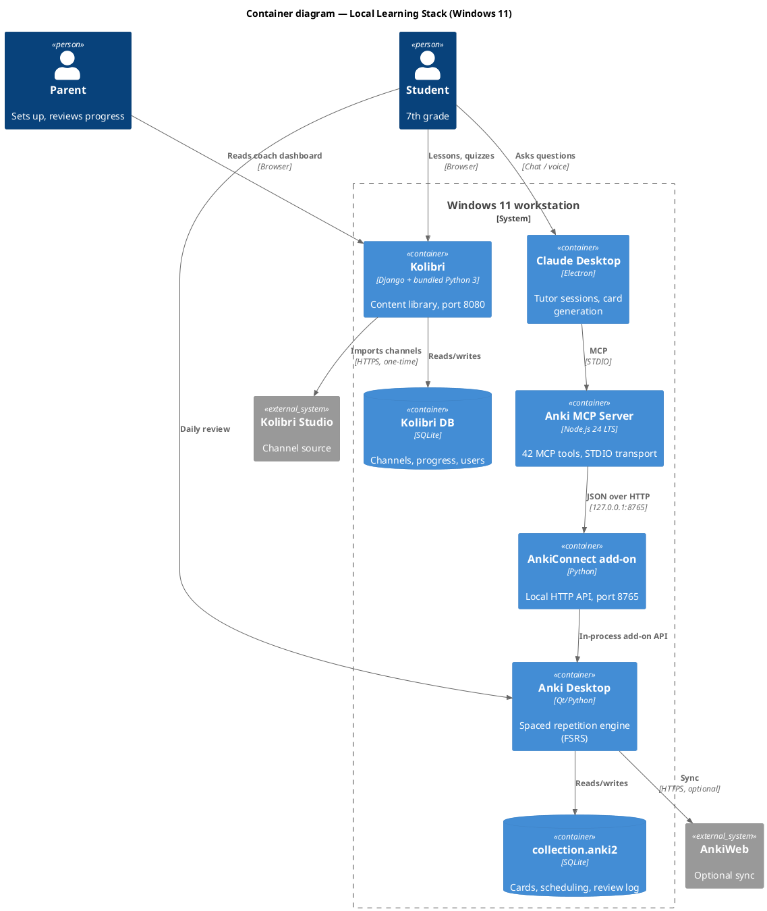

# Learning Stack — Windows 11 Installation Guide

Local, offline-capable learning environment for a 7th-grade student.
Three independent components, installed in order, each verifiable on its own.

| Component | Role | Runs on |
|---|---|---|
| Kolibri | Curriculum content + progress tracking | `127.0.0.1:8080` |
| Anki + AnkiConnect | Spaced-repetition store + local HTTP API | `127.0.0.1:8765` |
| Anki MCP Server | Bridge from Claude Desktop to AnkiConnect | STDIO (subprocess) |

Estimated time: 45–60 minutes. No component depends on the others at install
time — if one step fails, the rest still work.

---

## 0. Architecture



Everything except the two optional external links stays on `localhost`.

---

## 1. Prerequisites

- Windows 11, administrator account for the installers
- ~15 GB free disk (Kolibri channels are the bulk; Khan Academy alone is large)
- **Node.js 24.x LTS** — install from nodejs.org, use the `.msi`
- Claude Desktop installed and signed in

Node.js version matters: the MCP server requires **Node.js 22.12.0 or newer**,
and Node.js 20 reached end-of-life on 2026-04-30. Node 24 is the current Active
LTS line. Verify after install:

```powershell
node --version    # expect v24.x.x
npm --version
```

Do **not** install Python separately for Kolibri — the Windows installer bundles
its own Python 3.

---

## 2. Kolibri

### 2.1 Install

1. Download the Windows installer from `learningequality.org` (current
   documented release line: **0.19**).
2. Run the `.exe`. Select the installation language.
3. The installer includes Python 3 — confirm the install/upgrade when prompted.
4. Complete the setup wizard.
5. Kolibri auto-starts and opens the default browser at `http://127.0.0.1:8080`.
   First start is slow; wait it out.
6. Windows Firewall will prompt to allow the Python process. Click **Allow
   access** — without this Kolibri is unreachable from other devices on the LAN.

### 2.2 Initial facility setup

Run once. Choose a **self-managed / personal** facility (not school-managed) —
it keeps the account model simple.

Create two accounts:

| Account | Role | Purpose |
|---|---|---|
| `parent` | Admin / Coach | Assigns lessons, reads progress dashboard |
| `<child>` | Learner | Daily use |

### 2.3 Import content channels

`Device → Channels → Import → Kolibri Studio (online)`.

Recommended channels for this use case:

- **Khan Academy** — math, physics, chemistry (check for Ukrainian/Russian
  localized variants; coverage varies by subject)
- **OpenStax** — openly licensed textbooks
- **CK-12** — STEM exercises
- **Blockly Games** — programming introduction
- **EngageNY** — math curriculum sequences

Import selectively, not whole channels. Full channels run to tens of gigabytes.
Select topic-level subtrees matching the current school term.

### 2.4 Verify

- `http://127.0.0.1:8080` loads and shows the Learn page
- Log in as the learner, open one exercise, answer it, log in as coach and
  confirm the attempt appears in the Coach → Reports view

If progress does not appear in Coach reports, the content was opened as a guest
or as the admin account — re-check which user is logged in.

---

## 3. Anki + AnkiConnect

### 3.1 Install Anki

Download Anki desktop for Windows from `apps.ankiweb.net` and install with
defaults. Create a local profile. AnkiWeb sync is optional and not required by
anything in this guide.

Enable **FSRS** in `Tools → Preferences → Review` (modern scheduler; better
interval prediction than the legacy SM-2 algorithm).

### 3.2 Install AnkiConnect

1. `Tools → Add-ons → Get Add-ons...`
2. Enter code **`2055492159`**
3. Click OK, then restart Anki when prompted

### 3.3 Verify

Open `http://localhost:8765` in a browser. If the add-on is running you will see
the text `AnkiConnect` in the window. Nothing else is needed.

Two Windows-specific notes:

- A firewall prompt may appear on Anki startup, because AnkiConnect runs a local
  HTTP server. Anki must be unblocked for the add-on to function.
- **Anki must stay running in the background.** If Anki is closed, every MCP tool
  call fails with a connection error. Add Anki to Startup Apps if the child will
  use this daily.

### 3.4 Security posture (leave as default)

By default AnkiConnect binds only to `127.0.0.1`, so it is reachable only from
this machine. The binding address can be changed via
`Tools → Add-ons → AnkiConnect → Config` (`webBindAddress`). **Do not change it.**
There is no authentication on this API by default; exposing it to the LAN gives
anyone on the network full write access to the collection.

---

## 4. Anki MCP Server → Claude Desktop

Two installation paths. Path A is the recommended one.

### Path A — MCPB bundle (recommended)

1. Download the latest `.mcpb` bundle from the project's GitHub Releases page
   (`ankimcp/anki-mcp-server`).
2. In Claude Desktop: `Settings → Extensions`, drag and drop the `.mcpb` file.
   Alternative route: `Settings → Developer → Extensions → Install Extension`.
3. Confirm the AnkiConnect URL — default `http://localhost:8765` is correct for
   this setup.
4. Restart Claude Desktop.

The bundle ships its own dependencies, so this path does not depend on the
system Node.js install.

### Path B — npx via config file

Edit `%APPDATA%\Claude\claude_desktop_config.json`
(reachable from `Settings → Developer → Edit Config`):

```json
{
  "mcpServers": {
    "anki-mcp": {
      "command": "npx",
      "args": ["-y", "@ankimcp/anki-mcp-server", "--stdio"],
      "env": {
        "ANKI_CONNECT_URL": "http://localhost:8765"
      }
    }
  }
}
```

Restart Claude Desktop. On Windows, `npx` resolution inside Electron apps is a
common failure point — if the server does not appear, use the global install
instead:

```powershell
npm install -g @ankimcp/anki-mcp-server
```

```json
{
  "mcpServers": {
    "anki-mcp": {
      "command": "ankimcp",
      "args": ["--stdio"],
      "env": { "ANKI_CONNECT_URL": "http://localhost:8765" }
    }
  }
}
```

### 4.1 Optional hardening: read-only mode

While evaluating the setup, run the server read-only. Reads and review
operations (sync, answering cards, suspend/unsuspend) still work; content
modifications (`addNote`, `deleteNotes`, `createDeck`, `updateNoteFields`) are
blocked.

```json
"args": ["-y", "@ankimcp/anki-mcp-server", "--stdio", "--read-only"]
```

Remove the flag once you want Claude to generate cards.

### 4.2 Verify

With Anki running, ask Claude Desktop:

> List my Anki decks.

A correct response returns the actual deck list (`Default` on a fresh install).
If it returns an error, work through §7.

---

## 5. Claude Desktop project setup

Create one Project per subject. Attach the textbook PDF to the project knowledge.
Set the response style to **Learning**.

Project instructions:

```
You are a tutor for a 7th-grade student (Ukrainian curriculum).
Language: Ukrainian.

Session protocol:
1. Ask ONE diagnostic question on today's topic. Wait.
2. Explain only the gap the answer revealed — max 5 sentences, one example.
3. Give 3 problems, increasing difficulty, ONE at a time.
4. On a wrong answer: hint first. Second miss: full walkthrough.
   Never give the answer on the first attempt.
5. End the session by writing 3-6 Anki cards for what was covered,
   into deck "School::<Subject>", using the anki-mcp tools.
6. Output a progress block: topic, what was solid, what to redo next time.

Prerequisite mode (grade 6 gaps):
- Before starting any grade-7 topic, name the grade-6 skill it depends on
  and test it with 2 quick problems.
- Both correct — proceed immediately, no revision.
- One fails — teach ONLY that grade-6 skill (max 10 min), then return
  to the grade-7 topic in the same session.
- Never run a standalone "grade 6 revision" block.

Rules:
- Facts, formulas and definitions come from the attached textbook, not memory.
- Never write the final answer to a homework problem.
- If the student asks to "just solve it" — refuse once, then hint.
```

Create the deck hierarchy in Anki first (`School::Algebra`, `School::Physics`,
`School::Chemistry`, `School::English`). Deck nesting is limited to
`Parent::Child` — two levels.

---

## 6. Daily operation

| When | What |
|---|---|
| Morning | Anki auto-starts, student clears due cards (10–15 min) |
| Study session | Claude Desktop project, one topic, ~30 min |
| End of session | Claude writes new cards into the subject deck |
| Weekly | Parent reads Kolibri coach report; asks Claude for `review_stats` |

Ask Claude directly for retention analysis:

> Show review stats for School::Algebra over the last 30 days. Which cards is
> he failing repeatedly?

Cards failing repeatedly are not a memory problem — they signal a concept that
was never understood. Those go back into a teaching session, not more repetition.

---

## 7. Troubleshooting

| Symptom | Cause | Fix |
|---|---|---|
| `ERR_REQUIRE_ESM` in MCP logs | Node.js older than 22.12.0 | Install Node 24 LTS, restart Claude Desktop |
| All Anki tools fail | Anki not running | Start Anki; add to Startup Apps |
| `localhost:8765` blank in browser | AnkiConnect not installed or Anki not restarted after install | Re-check add-on code `2055492159`, restart Anki |
| Card update silently does nothing | The note is open in Anki's Browser window | Close the Browser or select a different note, then retry. Upstream AnkiConnect limitation, not a bug in the MCP server |
| MCP server absent from Claude Desktop | `npx` not resolvable from Electron | Use the MCPB bundle (Path A) or a global install |
| Kolibri unreachable from tablet/phone on LAN | Firewall rule for the Python process not allowed | Re-allow in Windows Defender Firewall → Allow an app |
| Kolibri slow on first start | Normal — database migration | Wait; do not kill the process |

MCP server logs are written by Claude Desktop. On Windows the log directory is
under `%APPDATA%\Claude\logs\` (the project README documents the macOS paths;
the Windows equivalent follows the same file naming — `mcp.log` and a
per-server log file).

---

## 8. Verification status of the facts in this guide

Written 2026-09-07. Anything marked *unverified* should be checked against the
source before relying on it.

| Claim | Status |
|---|---|
| AnkiConnect add-on code `2055492159`, port 8765, verify via `localhost:8765` | Verified — project README |
| AnkiConnect binds `127.0.0.1` by default; `webBindAddress` in add-on config | Verified — project README |
| Windows firewall prompt for AnkiConnect's HTTP server | Verified — project README |
| MCP server requires Node.js ≥ 22.12.0; Node 20 EOL 2026-04-30 | Verified — project README |
| MCPB install route, `%APPDATA%\Claude\claude_desktop_config.json`, npx config shape, `--read-only`, 42 tools | Verified — project README |
| Note-update failure when the note is open in the Browser | Verified — project README, listed as a critical limitation |
| MCP server runs locally, no telemetry | Verified — project privacy policy |
| Kolibri Windows `.exe` bundles Python 3, serves `127.0.0.1:8080`, firewall prompt | Verified — Kolibri user guide |
| Kolibri release line 0.19 | Verified as of the current docs; may have advanced |
| Kolibri channel list (Khan Academy, OpenStax, CK-12, Blockly Games, EngageNY) | Verified for the English channel set; **localized coverage unverified** |
| Node 24.x is the current Active LTS | Verified — nodejs.org release list |
| Windows log path `%APPDATA%\Claude\logs\` | **Unverified** — inferred from the documented macOS path |
| FSRS toggle location in Anki Preferences | **Unverified** — menu wording varies across Anki releases |

The MCP server is at **0.22.0 and self-described as beta**, with breaking changes
permitted under 0.x versioning. Pin the version if this setup needs to be stable
for months rather than weeks.
